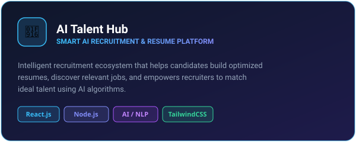
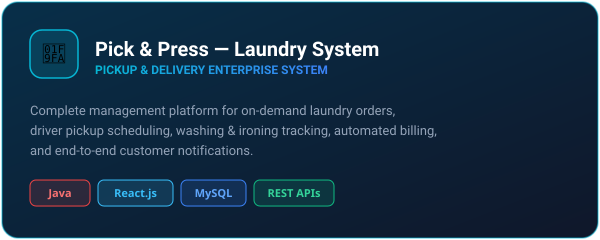
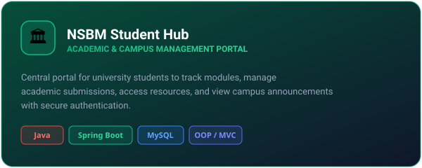
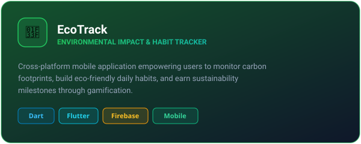
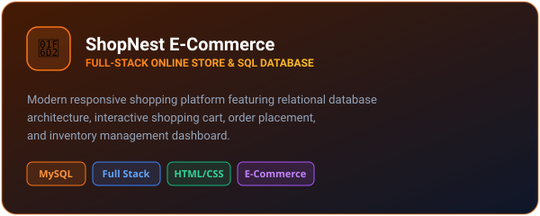
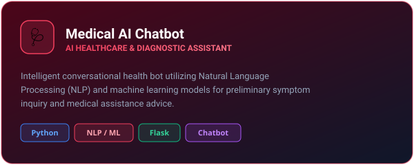

  

<h1 align="center">
  
</h1>

  
  
  
  

---

## 🎓 Education & Academic Profile

  

  
  
  
  

---

## 👨‍💻 About Me

Experienced and enthusiastic **Computer Science Undergraduate** and **ICT Educator** with strong hands-on experience building practical, modern full-stack web applications, AI-integrated solutions, and educational platforms.

- 🎓 **BSc (Hons) in Computer Science** at **NSBM Green University**
- 👨‍🏫 **ICT Educator & Mentor** for **Grade 6 – 11** students (Theory, Practical & Paper classes)
- 💡 Passionate about **Full-Stack Development**, **AI/NLP Systems**, **System Architecture**, and **Clean Code**
- 🚀 Strong problem-solving abilities and dedication to simplifying complex technical concepts for learners

⚡ *Fun Fact:* **"No Pain, No Gain"** — I believe structured practice and continuous iteration create mastery.

---

## 🛠️ Tech Stack & Skills

  

  
  
  
  
  

---

## 🚀 Featured Projects

<table>
  <tr>
    <td width="50%" valign="top">
      
       
      

        <a href="https://github.com/shanilka1/AI-Talent-Hub"><b>🔗 View Repository</b></a>
      

    </td>
    <td width="50%" valign="top">
      
       
      

        <a href="https://github.com/KawyaDissanayaka/laundry-pickup-delivery-management-system-frontend"><b>🔗 Frontend</b></a> • 
        <a href="https://github.com/KawyaDissanayaka/laundry-pickup-delivery-management-system-backend"><b>⚙️ Backend</b></a>
      

    </td>
  </tr>
  <tr>
    <td width="50%" valign="top">
      
       
      

        <a href="https://github.com/shanilka1/nsbm-student-hub"><b>🔗 View Repository</b></a>
      

    </td>
    <td width="50%" valign="top">
      
       
      

        <a href="https://github.com/shanilka1/EcoTrack"><b>🔗 View Repository</b></a>
      

    </td>
  </tr>
  <tr>
    <td width="50%" valign="top">
      
       
      

        <a href="https://github.com/DarshanaChinthaka/web-project-EC.git"><b>🔗 View Repository</b></a>
      

    </td>
    <td width="50%" valign="top">
      
       
      

        <a href="https://github.com/KawyaDissanayaka/Medical_ChatBot"><b>🔗 View Repository</b></a>
      

    </td>
  </tr>
  <tr>
    <td colspan="2" valign="top">
      
       
      

        <a href="https://github.com/shanilka1/online-class-payment-site-english"><b>🔗 View Repository</b></a> • 
        <a href="https://github.com/shanilka1/ict-game-shanilka"><b>🎮 ICT Interactive Game</b></a>
      

    </td>
  </tr>
</table>

---

## 🏆 GitHub Achievements & Milestones

  

---

## 📊 GitHub Statistics & Activity

  
  

  

  

---

## 🐍 Contribution Snake

  

---

## 📅 Commit Activity

  

---

## 👨‍🏫 ICT Teaching & Mentorship

  
  
  

> 💡 **Teaching Philosophy:** *"No Pain, No Gain."*  
> Guiding next-generation students to master Information and Communication Technology with conceptual clarity, practical programming exercises, and structured analytical problem-solving.

---

## 📫 Get In Touch

  
  &nbsp;
  
  &nbsp;
  
  &nbsp;
  

  📱 <b>Hotline:</b> <a href="tel:+94767094260">+94 76 709 4260</a> / <a href="tel:+94719374260">+94 71 937 4260</a> &nbsp;|&nbsp; 📧 <b>Email:</b> <a href="mailto:shanilkamax111@gmail.com">shanilkamax111@gmail.com</a>

  
  
  

---

  ✨ <b>Teach • Build • Innovate</b> ✨

  

